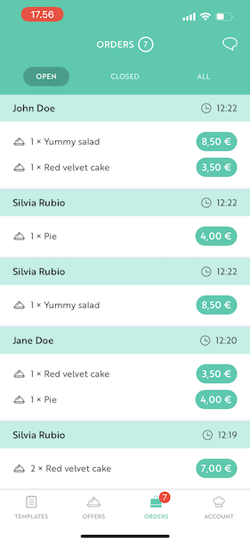

# Flutter assignment

The aim of this task is to provide proof of your technical abilities and material for discussion in the technical interview. You have 2 choices,

1. Provide a sample of your work for us to review
2. Write and submit some new code matching specifications described below

In either case, you can submit your code by sharing access to a git repo. We will evaluate the code as if it is going to a production app, so bear that in mind with your submission. Our team will review your code, and either progress you onto the technical interview or provide feedback as to why you are not continuing from this point.

# 1. Providing a sample

You can send us any mobile code you have available, written by yourself. This could be for an iOS or Android app, or cross-platform code. This should be a significant sample of code and e.g. not just the implementation for a tutorial. As a guideline, if it's less than 1000 lines of code then it's probably not suitable.

Along with your code, please provide some extra context for the sample. We'd like to know things like,

- What is the code for?
- Why did you write this code?
- How long ago did you write the code?

# 2. Submitting new code

If you don't have any recent code that you'd like to share with us, you may instead implement new code for the following assignment. You should not spend more than 3 - 4 hours on this assignment, it is okay not to complete everything and to leave some requirements unfulfilled. 

You may indicate in your submission if there are things you didn't have time for, or would change if you had more time. Any extra notes on your thought process, plans or challenges are welcome too.

# Coding task

## Background - Partner orders

Our partner app has a view that helps partners track the incoming orders. When customers visit the venue to fetch their orders the partners mark the orders as picked up. The UI are shown as:
 - Open -> not picked up by the customer
 - Closed -> picked up by the customer

Partners have expressed that it is difficult to find multiple orders placed by the same customer when there is a long list of orders and customers have place multiple orders throughout the day. Check `assets/orders-video.mov`

# The assignment
Please implement an improved version of the orders view with the requirements below:

## Must-have
1. The app works on web, Android and iOS.
2. An orders list where orders from the same customers are grouped together.
2. Orders can be marked as picked up.
3. Orders can be filtered by open/closed/all orders.

## Nice-to-have
1. Partners have an option to "undo" marking an order as picked up (available only for 10 seconds).
2. Think about how to improve the backend code, you can make the changes or make some notes about the improvements that can be done.

For the purpose of this assigment, we have created an overly-simplified version of the backend. Be warned, the product may have poor design decisions.

It is up to you to design the UX and implementation in whatever way you see fit to fulfil these requirements. Feel free to change and refactor as much or as little of the codebase as you like. 

We are not necessarily expecting you to write perfect code as time is very limited for this assignment, but be ready to discuss your choices and what you might have done with more time. **We expect you to work only on the Flutter part of this repo.**

# Technical details

## Repo content

For the purpose of this assignment this repo contains the app's frontend and backend. `app` is a Flutter application and `backend` an Express server written with Typescript.

## Running the app

### Running `backend`
1. Install dependencies `yarn`
2. Run dev server `yarn dev`

### Running `app`
1. Run the app `flutter run`

## Submitting the task
Please clone this repo and create a new git branch with your changes. Ideally you will create a private repo on GitHub and give [@resq-bot](https://github.com/resq-bot) sufficient permissions to view. Again ideally, you would raise a PR from your branch to `main` as if this were a real piece of work. If, for some reason, you cannot submit your changes in the ideal way, please discuss with us.

In reality, we always favour small PRs reviewed and merged quickly, but for this assignment it is okay to make a larger PR with more changes that you would normally include at once.

## About the technical interview

In the tech interview we will discuss this repo and dig into some concrete ideas about how to improve it and prepare it for production release. You therefore might want to spend some time reading through the code, looking at the functionality and design and coming up with some ideas ahead of time. If you want, you can submit some short notes on your thinking along with this assignment, or you can wait to discuss in the tech interview.
